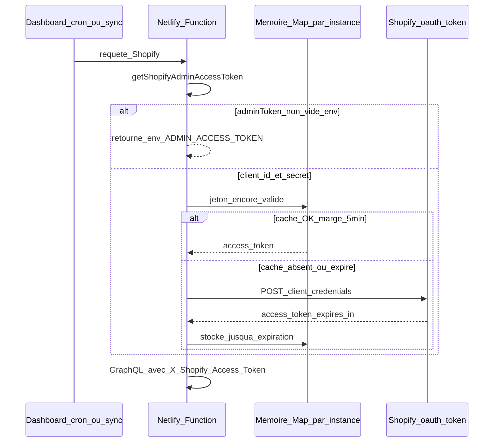

# Scopes Shopify & variables d’environnement

**Déploiement Netlify** (build, UI des variables, crons) : voir [`DEPLOY_NETLIFY.md`](./DEPLOY_NETLIFY.md).

## Scopes Shopify pour le middleware

Pour que le middleware puisse **uniquement** gérer le **stock** à la location UK (aucun accès commandes, clients, etc.), limitez l’app aux scopes ci‑dessous — notamment dans le **Dev Dashboard** (version de l’app → **Access scopes**) ou le `shopify.app.toml` si vous utilisez la CLI.

### Scopes requis (minimal)

| Scope                 | Usage                                                                            |
| --------------------- | -------------------------------------------------------------------------------- |
| `read_inventory`      | Lire les niveaux de stock et les `inventory_item_id` (mapping SKU).              |
| `read_locations`      | Lire la location et ses `inventoryLevels` (stock par location) pour le dashboard. |
| **`write_inventory`** | **Mettre à jour les quantités** pour la location UK (sync stock Byrd → Shopify). |
| `read_products`       | Résoudre SKU → `inventory_item_id` (produits / variantes).                       |

Sans **`write_inventory`**, les stocks ne peuvent pas être mis à jour.

### Scopes à retirer si vous les aviez ajoutés pour d’anciennes intégrations

Le middleware **n’utilise pas** l’API commandes ni les fulfillment orders pour la sync stock. Vous pouvez **désinstaller / republier une version** de l’app avec uniquement les scopes du tableau ci‑dessus et retirer par exemple :

| Scope à éviter (inutile ici) | Pourquoi |
| ---------------------------- | -------- |
| `read_orders`, `write_orders`, `read_all_orders` | Pas de lecture / traitement de commandes. |
| `read_assigned_fulfillment_orders`, `write_assigned_fulfillment_orders` | Idem (lié aux commandes). |
| `read_merchant_managed_fulfillment_orders`, `write_merchant_managed_fulfillment_orders` | Idem. |

Après réduction des scopes sur le Dev Dashboard, le marchand doit **réapprouver** les permissions pour la boutique concernée (prompt dans l’admin à la prochaine ouverture de l’app ou mise à jour d’installation).

### Scopes optionnels

Tout autre scope non listé dans « requis » est **optionnel** pour ce dépôt ; moins il y en a, mieux c’est pour le principe du moindre privilège.

---

## Variables d’environnement

### Shopify

| Variable                               | Description                                                 |
| -------------------------------------- | ----------------------------------------------------------- |
| `PROD_SHOPIFY_STORE_DOMAIN`            | Domaine du shop **production** (repli possible : `SHOPIFY_STORE_DOMAIN`). |
| `PROD_SHOPIFY_ADMIN_ACCESS_TOKEN`      | *(Optionnel si client credentials)* Token Admin API statique (repli : `SHOPIFY_ADMIN_ACCESS_TOKEN`). |
| `PROD_SHOPIFY_UK_LOCATION_ID`          | ID numérique location UK **production** (repli : `SHOPIFY_UK_LOCATION_ID`). |
| `PROD_SHOPIFY_CLIENT_ID` / `CLIENT_SECRET` | **Dev Dashboard** : id + secret d’app ; le middleware obtient un access token (~24 h) et le **rafraîchit tout seul** (cache en mémoire par instance). Repli : `SHOPIFY_CLIENT_*`. |
| `STAGING_SHOPIFY_*`                    | Même famille pour le **staging** (sans repli sur les vars prod). |

### Auth Shopify : deux modes (cumul exclusif côté usage effectif)

1. **Token dans `*_ADMIN_ACCESS_TOKEN`** : app créée dans la boutique (legacy) ou copie manuelle ; pas d’expiration imposée par Shopify.
2. **Uniquement `*_CLIENT_ID` + `*_CLIENT_SECRET`** : app **Dev Dashboard** installée sur le shop ; le middleware appelle `client_credentials` puis met le jeton en cache jusqu’à ~5 minutes avant `expires_in` (~24 h). Aucun `shopify:get-admin-token` manuel nécessaire en prod une fois les variables Netlify renseignées.

Vous pouvez laisser **`PROD_SHOPIFY_ADMIN_ACCESS_TOKEN` vide** sur Netlify si prod repose entièrement sur client_id + secret.

### Guide : lancement auto + refresh des tokens (Dev Dashboard)

Le code ([`src/utils/shopifyAccessToken.ts`](../src/utils/shopifyAccessToken.ts)) obtient le jeton avant chaque usage de l’Admin API. Aucun `npm run shopify:get-admin-token` n’est requis au quotidien si vous utilisez **uniquement** `CLIENT_ID` + `CLIENT_SECRET` (et laissez `*_ADMIN_ACCESS_TOKEN` vide).

#### Règle de priorité (important)

| Situation | Comportement |
| --------- | ------------ |
| `*_ADMIN_ACCESS_TOKEN` est **non vide** | Ce token est **toujours** utilisé. Pas de `client_credentials`, **pas de refresh auto** côté middleware. |
| `*_ADMIN_ACCESS_TOKEN` **vide** et `CLIENT_ID` + `CLIENT_SECRET` renseignés | Le middleware appelle OAuth `client_credentials`, met le jeton en **cache mémoire** et le renouvelle environ **5 minutes avant** l’expiration Shopify (`expires_in` ≈ 24 h). |

Pour un fonctionnement **100 % automatique** avec une app Dev Dashboard, gardez **`PROD_SHOPIFY_ADMIN_ACCESS_TOKEN`** (et staging si besoin) **vide** sur Netlify et en local.

#### Flux (aperçu)

#### Cold starts (Netlify)

Le cache vit dans la **mémoire du processus** : chaque **nouvelle instance** sans historique refait **un** appel `client_credentials` au premier besoin. C’est attendu et léger.

#### Prérequis Shopify (une fois)

1. App configurée dans le **Dev Dashboard** avec les scopes **minimal stock** (tableau « Scopes requis » plus haut).
2. **Installer l’app** sur la boutique concernée (prod et/ou staging) : Dev Dashboard → l’app → **Install app** → le bon `*.myshopify.com`. Sans ça, `client_credentials` renvoie une erreur.
3. Copier **Client ID** et **Client secret** (Settings de l’app) dans les variables d’environnement.

#### Check-list premier déploiement ou nouveau poste

1. Remplir `.env` à partir de [`.env.example`](../.env.example) (ne pas commiter les secrets).
2. Pour le mode auto : `PROD_SHOPIFY_STORE_DOMAIN`, `PROD_SHOPIFY_CLIENT_ID`, `PROD_SHOPIFY_CLIENT_SECRET`, `PROD_SHOPIFY_UK_LOCATION_ID` ; **`PROD_SHOPIFY_ADMIN_ACCESS_TOKEN` vide**.
3. Reporter les mêmes clés dans **Netlify → Environment variables** ; redéployer après changement.
4. Vérifier : `npm run shopify:auth-check` (sans ligne `*_ADMIN_ACCESS_TOKEN` dans `.env`, un export shell obsolète est **ignoré** et le script utilise `client_credentials`).
5. Lancer l’app : `npm run dev` (`netlify dev`) — les fonctions utilisent le même mécanisme.

#### `netlify dev` et fichier `.env`

Les fonctions ne reçoivent pas toujours automatiquement les clés définies dans `.env`. **`loadEnvFile`** (`src/utils/loadEnvFile.ts`) remonte depuis `process.cwd()` et `__dirname` pour trouver `.env`, puis ne remplit une clé que si elle est absente ou **chaîne vide** — utile quand un site Netlify lié injecte `SLACK_WEBHOOK_URL` vide. Redémarrer `netlify dev` après modification de `.env`. En dernier recours : `set -a && source .env && set +a` puis `npx netlify dev`.

#### `netlify dev` et variables shell

Le middleware lit **`process.env`** (comme en production). Si tu as un vieux **`export SHOPIFY_ADMIN_ACCESS_TOKEN=...`** dans le terminal, `netlify dev` l’injecte souvent dans l’environnement des fonctions : avec une config **OAuth prod** (`PROD_SHOPIFY_CLIENT_ID` + `SECRET` sans `PROD_SHOPIFY_ADMIN_ACCESS_TOKEN`), ce repli **`SHOPIFY_ADMIN_ACCESS_TOKEN` est maintenant ignoré** côté `buildConfig` — comme pour le script `shopify:auth-check`. En cas de doute : `unset SHOPIFY_ADMIN_ACCESS_TOKEN`.

**Site Netlify lié :** si le dépôt est associé à un site (`netlify link`), `netlify dev` peut **fusionner les variables du site** (interface Netlify) avec ton `.env` local. Un `PROD_SHOPIFY_ADMIN_ACCESS_TOKEN` défini **sur le site** mais absent du `.env` local explique un snapshot encore en `static_admin_token` après avoir vidé le fichier — le retirer dans **Netlify → Site configuration → Environment variables** (ou lancer le dev avec les options qui n’importent pas le remote, selon ta version CLI).

Après mise à jour du code, **`shopify-config-snapshot`** expose **`adminTokenProcessEnvKeysNonEmpty`** : la liste des clés encore non vides dans `process.env` qui alimentent le token statique — pour voir d’où vient la valeur sans deviner.

#### Débogage (401 / « Invalid API key »)

1. **`npm run shopify:auth-check`** et `SHOPIFY_TARGET=staging npm run shopify:auth-check` : si ça échoue aussi, le problème est boutique / credentials (secret révoqué, app non installée sur ce `*.myshopify.com`, mauvais `CLIENT_ID`).
2. **`SHOPIFY_DEBUG=1`** dans `.env` (ou **`DASHBOARD_DEBUG=1`**, déjà utilisé pour l’auth dashboard) : les logs JSON incluent l’événement **`shopify_auth_debug`** avec `target`, `storeDomain`, `authMode` (`static_admin_token` vs `client_credentials`), préfixes non secrets du jeton et du client id — pour vérifier que **prod** n’utilise pas par erreur une config **staging**.
3. En mode **`client_credentials`**, une **première** 401 GraphQL déclenche une **invalidation du cache** et une **nouvelle demande de jeton** avant d’échouer définitivement (jeton OAuth périmé ou incohérent en mémoire).
4. Si **`authMode`** est `static_admin_token` et 401 persiste : régénérer ou recoller **`PROD_SHOPIFY_ADMIN_ACCESS_TOKEN`** (même boutique que `PROD_SHOPIFY_STORE_DOMAIN`).
5. **Endpoint diagnostic (recommandé)** : une fois connecté au dashboard (cookie valide), ouvrir  
   `GET /.netlify/functions/shopify-config-snapshot`  
   (ex. `http://localhost:8888/.netlify/functions/shopify-config-snapshot` en local).  
   La réponse JSON compare **ce que voient les fonctions** (`snapshot` : longueurs, `authMode`) avec des **probes** directes **`oauth`** et **`graphql`**.  
   - Si **`clientSecretLength: 0`** dans `snapshot` alors que ton `.env` en a un → `netlify dev` n’injecte pas les variables : lancer la CLI **depuis la racine du dépôt**, vérifier le fichier `.env` à cet endroit, ou `set -a; source .env; set +a` puis `npx netlify dev`.  
   - Si **`oauth.ok`** est `true` mais **`graphql.httpStatus`** est `401` → cas rare (version API, token incohérent) : activer `SHOPIFY_DEBUG=1`, regarder `shopify_auth_debug` dans les logs.

#### Pourquoi `shopify:auth-check` peut réussir alors que le dashboard échoue ?

| Situation | Explication | Piste de solution |
| -------- | ----------- | ------------------- |
| Script lit `.env` en priorité, fonctions lit `process.env` | Le script **ignore** un export shell si OAuth est dans le fichier ; sur `netlify dev`, le shell **fusionne** avec `.env` — des règles dans `buildConfig` alignent le tout, mais si **le secret n’est pas injecté** dans le process des fonctions, les deux diffèrent. | Vérifier **`shopify-config-snapshot`** : `clientSecretLength` prod/staging. |
| Ancien bundle / hot reload | Une fonction peut tourner avec un vieux build. | **Redémarrer** entièrement `npm run dev`. |
| Jeton statique périmé | `authMode: static_admin_token` avec mauvais `shpat_`. | Supprimer / régénérer `*_ADMIN_ACCESS_TOKEN` ou passer à `client_credentials` uniquement. |
| App pas installée sur le shop | `client_credentials` échoue ou token invalide pour ce domaine. | Dev Dashboard → **Install app** sur le bon `*.myshopify.com`. |
| `SHOPIFY_ADMIN_ACCESS_TOKEN` exporté (shell) | Pollution : autrefois pris avant correction. | `unset SHOPIFY_ADMIN_ACCESS_TOKEN` ; la doc ci‑dessus décrit l’ignorage côté prod. |

### Byrd (WMS)

Documentation : [Byrd Developer Docs](https://developers.getbyrd.com/docs/getting-product-details).

| Variable            | Description                                                                                                   |
| ------------------- | ------------------------------------------------------------------------------------------------------------- |
| `BYRD_API_KEY`      | Clé API (ex. `bk_...`). **Ne pas commiter** — à mettre uniquement dans les variables d’environnement Netlify. |
| `BYRD_API_SECRET`   | Secret API (ex. `bs_...`). **Ne pas commiter** — idem.                                                        |
| `BYRD_BASE_URL`     | (Optionnel) Base de l’API. Si vide : défaut construit dans `config.ts` (hôte public documenté par GetByrd).   |
| `BYRD_WAREHOUSE_ID` | (Optionnel) ID de l’entrepôt UK dans Byrd. Si un seul entrepôt, il peut être déduit.                          |

L’authentification Byrd se fait via **JWT** : le middleware appelle `POST /v2/login` avec `username` = `BYRD_API_KEY` et `password` = `BYRD_API_SECRET`, puis utilise le token dans l’en-tête `Authorization: Bearer <token>` pour les appels produits (stocks).

### Sync / historique

| Variable                | Description                                                                                            |
| ----------------------- | ------------------------------------------------------------------------------------------------------ |
| `SYNC_RUN_HISTORY_PATH` | (Optionnel) Fichier JSON pour l’historique des runs. Si défini, utilisé partout. Sinon en **production** (runtime Lambda / fonctions Netlify) : **Netlify Blobs** ; avec `netlify dev` (`NETLIFY_DEV`) : fichier `data/sync-runs.json`. |

L’historique est plafonné (`SYNC_RUN_HISTORY_CAP` dans `src/utils/syncRunHistory.ts`, actuellement 500 entrées). Si le digest Slack signale une **saturation**, les totaux de la veille peuvent être incomplets : augmenter la constante ou archiver ailleurs.

### Slack — activer / désactiver les envois

| Variable | Description |
| -------- | ----------- |
| `SLACK_NOTIFICATIONS` | `0`, `false`, `off` ou `no` : **aucun** appel au webhook (ni digest, ni message après sync). Défaut : activé. Réglage : `.env` / Netlify, ou **dashboard → onglet Slack** si « priorité dashboard » est cochée. |
| `SLACK_PER_RUN_REPORTS` | `0` / `false` / `off` / `no` : pas de Slack **après chaque** `sync-uk` ou sync stock ; le **digest** peut rester actif. Ignoré si le master (notifications) est coupé. |
| `SLACK_DAILY_DIGEST` | `0` : pas de **rapport journalier** (cron ni `daily-slack-digest-manual`). Ignoré si le master est coupé. |
| `SLACK_WEBHOOK_URL` | URL Incoming Webhook ; sans elle, aucun envoi même si les flags sont activés. |
| `SLACK_SETTINGS_PATH` | (Optionnel) Fichier JSON pour les surcharges dashboard. Sinon en **production** fonctions : **Netlify Blobs** ; en `netlify dev` : `data/slack-settings.json` (voir `src/utils/storageBackend.ts`). |

**Interface dashboard** : onglet **Slack** → cocher « Contrôler depuis le dashboard », puis les trois options. **GET/PUT** `/.netlify/functions/slack-settings` (auth cookie identique au reste du dashboard). Tant que la priorité dashboard est **désactivée**, seuls `.env` / Netlify déterminent le comportement (comme avant).

### Slack — rapport journalier

En plus du message **après chaque run** (si `SLACK_PER_RUN_REPORTS` activé), la fonction planifiée **`daily-slack-digest`** envoie un **récapitulatif de la veille** (journée civile dans le fuseau choisi) :

- nombre d’exécutions `sync-uk` vs sync stock seul, par cible **prod** / **staging** ;
- total des ajustements Shopify réussis et des lignes en erreur / ignorées ;
- liste des **SKU** concernés par au moins un `user_error`, `skipped_no_inventory_item` ou `exception` (extrait, tronquée si volumineuse) ;
- extraits des runs en **échec global** (promesse rejetée ou erreurs stock).

| Variable | Description |
| -------- | ----------- |
| `SLACK_WEBHOOK_URL` | Obligatoire pour envoyer quoi que ce soit (même URL pour digest et alertes par run). |
| `SLACK_DAILY_DIGEST` | `0` pour désactiver uniquement le digest (voir aussi `SLACK_NOTIFICATIONS`). |
| `SLACK_DAILY_DIGEST_TIMEZONE` | Fuseau IANA pour définir « hier » (défaut `Europe/Paris`). |
| `SLACK_DAILY_DIGEST_SITE_LABEL` | Libellé optionnel dans l’en-tête du message. |
| `DAILY_DIGEST_HTTP_SECRET` | (Optionnel, **recommandé en prod**) Secret pour autoriser uniquement les appels à `daily-slack-digest-manual` (`Authorization: Bearer …` ou `X-Daily-Digest-Secret`). Vide en local = pas de contrôle d’accès sur cette URL. |

L’**heure d’envoi** est celle du cron Netlify (`netlify.toml`, en **UTC**) : ajuster pour correspondre au « début de journée » souhaité.

**Déclenchement manuel (recommandé)** : fonction **`daily-slack-digest-manual`** (pas d’entrée `schedule`), donc URL HTTP normale en local et en prod :

- Local : `http://localhost:8888/.netlify/functions/daily-slack-digest-manual` (GET ou POST).
- Prod : `https://<votre-site>.netlify.app/.netlify/functions/daily-slack-digest-manual`.

Si **`DAILY_DIGEST_HTTP_SECRET`** est défini (recommandé en prod), ajouter l’entête  
`Authorization: Bearer <secret>` **ou** `X-Daily-Digest-Secret: <secret>`. Sans cette variable, l’URL reste publique (pratique en dev, déconseillé sur Internet).

La fonction **`daily-slack-digest`** reste réservée au **scheduler** Netlify : l’aperçu dans le navigateur peut afficher un avertissement (« scheduled function ») et en production une requête HTTP directe n’est pas le bon usage.

**Pistes d’enrichissement** (non implémentées) : moyenne sur 7 jours, alerte si **zéro** run la veille, top SKU par volume de deltas, lien direct vers le dashboard, séparation de webhooks « alertes » vs « reporting ».

---

## Dashboard

- **URL** : après déploiement Netlify, la page d’accueil du site (ex. `https://votre-site.netlify.app/`) affiche le dashboard.
- **Runs sync** : historique des exécutions (`sync-uk`, sync stock seule) avec compteurs succès/échecs, détail par SKU et JSON ; suppression possible par run.
- **Logs techniques** : le middleware peut toujours écrire en fichier si `LOG_FILE_PATH` est défini ; pour le debug infra, utiliser les journaux Netlify des fonctions.
- **Comparaison des stocks** : tableau Byrd (WMS) vs Shopify (location UK) par SKU, colonne **Type** (produit simple / **bundle** natif Shopify / **composant** d’un bundle, via l’API produit), indicateur « Aligné » (sur la quantité **disponible à la vente**, comme la sync), colonne **Var. / Inv.** avec l’**ID variante** et l’**ID article d’inventaire**. Les quantités **disponibles** peuvent être **négatives** si le stock **engagé** dépasse le physique ; l’infobulle indique **physique** et **engagé**. Les SKU sont **normalisés** (trim, espaces).
